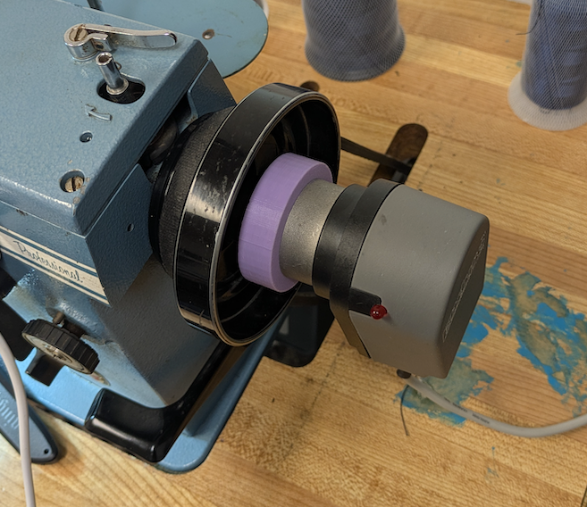
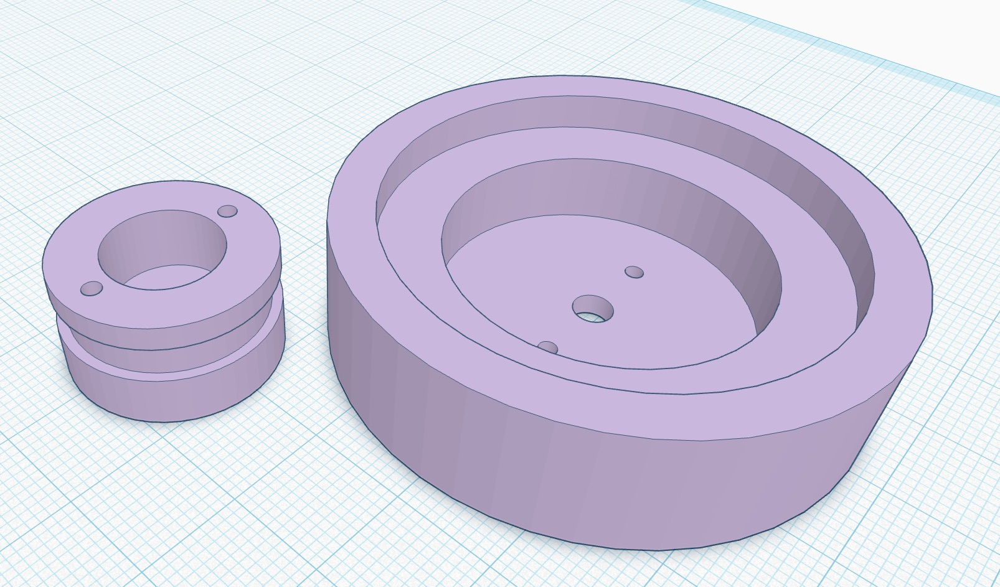
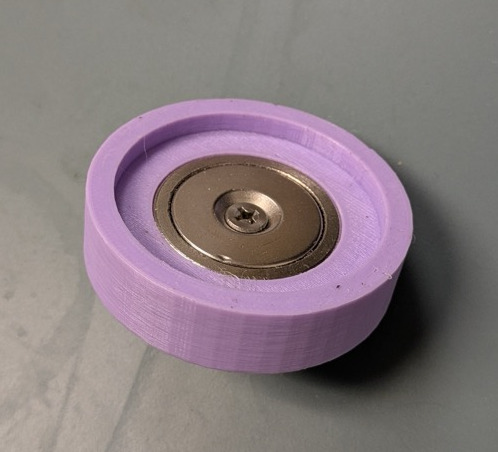
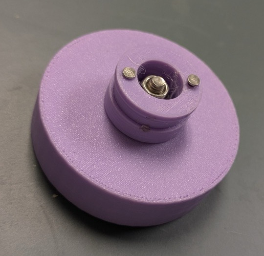
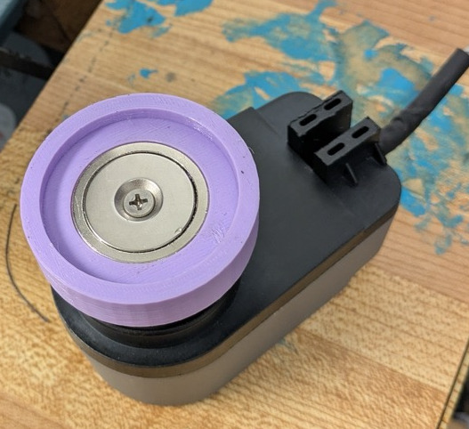
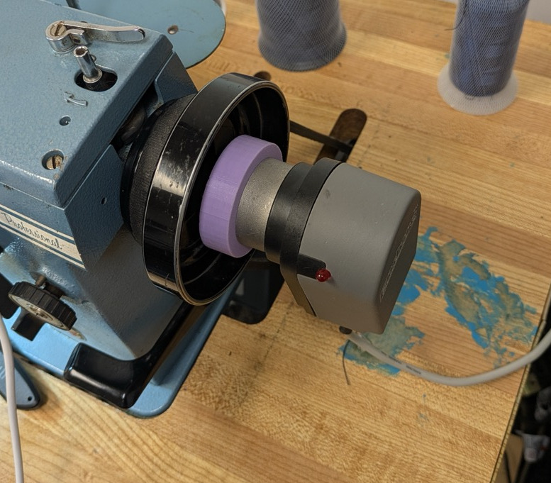

# Singer 20u33 Servo Position Sensor Adapter
Everything you need to retrofit your Singer 20u33 (and clones) servo upgrade with a needle position sensor.

## Overview
The Singer 20U33 / 20-33 and clones are industrial sewing machines that utilize a hand clutch to disengate / engage the sewing mechanism from the bobbin winder.  This allows the operator to wind bobbins without running the sewing mechanism.  This style handwheel is also found in many vintage Singer sewing machines such as the 66/99, featherweight and others.  Although these domestic machines are not really canidates for attaching an industrial servo, the technique outlined here should work.  Afterall, someone is bound to find a ~reason~ excuse to retrofit one sooner or later.

### But 'Why?", Servos and Industrial Clutch Motors
Industrial sewing machines have historically used powerful AC motors spinning at all times, and a foot clutch to engage the drive pully.  This arrangement is fantastic for highly skilled operators.  The amount of on-demand power is amazing, and with skill the speed can be controled with high precision.

For the rest of us, these beasts (I can barely lift the motor it is so heavy) are intimidating, noisy and difficult to control.

Servos on the other hand work a lot like a domestic foot pedal.  Press the pedal and the motor spins.  However, if a needel positioner is installed two other features are available.  
 1. By default, if the sensor is attached, the servo is configured to always stop with the needle in the DOWN position.  This is handy for making tight turns.  Stop sewing, lift the foot, turn the material, lower the foot and continue sewing.  The needle keeps the work item aligned, and thread tension is preserved.  
 2. By default the servo is configured to bring the needle to the UP position by pressing on the heel of the foot pedal.  Stop the machine, press your heel against the bottom of the pedel and the needle lifts out of the way and into the thread release position.

Both of these operations are highly repeatable and reliable.

If these two capabilites don't sound like a big deal you are either not the target audiance (you are likely a professional), or you haven't used an industrial machine with a servo yet.  Because once you do, boy-howdy, there is no going back.

I researched off-the-shelf adapters to mounting a position sensor without any luck.  I found a refrence to a discontinued adapter that cost about $90 USD.  But the reference was three years old and the part is unavailable.  So I designed my own 3D printed solution.  Sharing is caring, which brings us here.  Oh, look at the [BOM](bom.md), this adapter costs less than $5.00 USD (2025).

Enjoy!

## Requirements
1. Inexpensive.
2. Easy.
3. Non-destructive.  Don't replace or modify any part of the machine.
4. The position sensor expects a certain shape and size flange to attach to.  The flange must be mounted on and synchronized with the main shaft.

## Solution

The solution involves a 3D printed flange (comprised of two sub-assemblies) and a 130lb magnet that holds the flange on the existing handwheel.

## Instructions

Print the two pieces of the flange (no supports necessary).

Place the Magnet and the Screw in the large half of the flange.

Flip the large half of the flange over, attach the small half of the flange with the whiz nut.  Insert the two alignment pins (I had to trim mine to lenght).

Attach the sensor to the flange

Finally, snap (you have no choice, it will SNAP!) the assembly onto the handwheel.

## Calibrate the sensor position

The goal here is to manually turn the machine until the needle is in the UP position.  Then, turn the flange (you have to hold the handwheel, the magnet has a strong grip) until the LED on the sensor activates.  

If that doen't work (no LED for instance), sew a stitch, and adjust the flange position based on how far off it is.  Usually you can zero in with only a couple of tries.

That's it.

Released under the [Creative Commons non-commercial license](license.txt)

